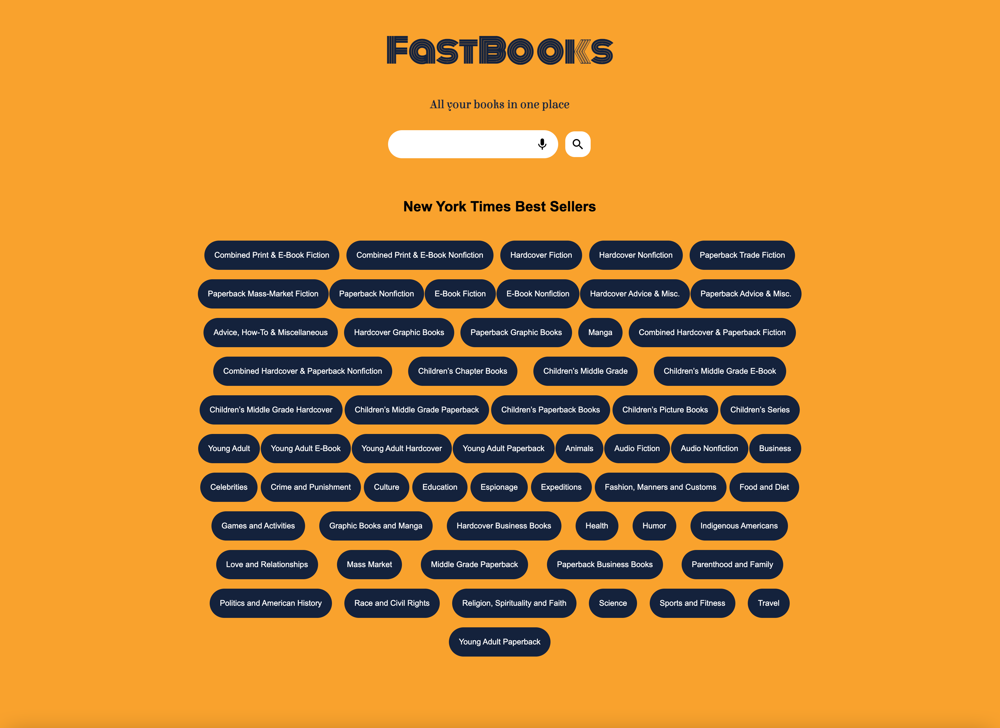
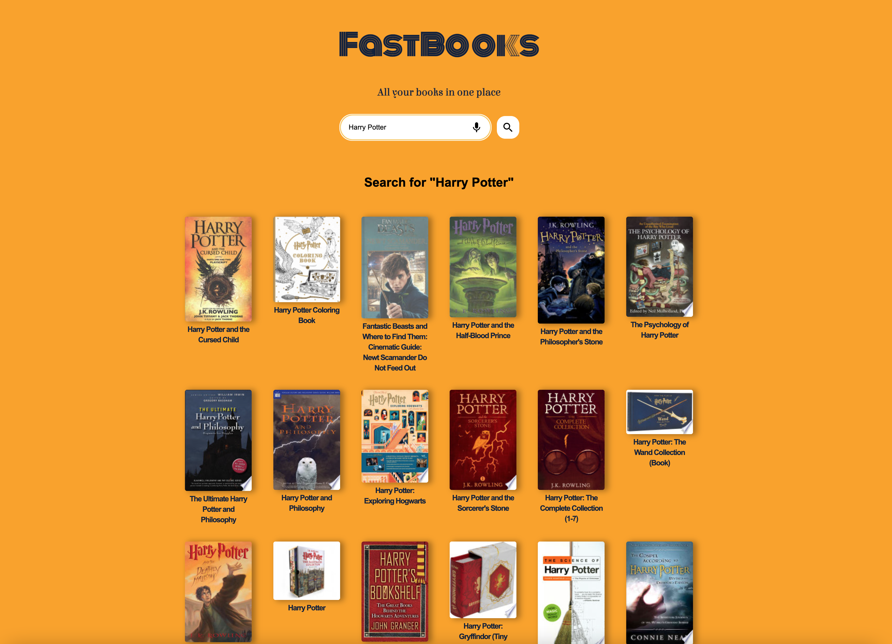

# FastBooks

## SUMMARY

FastBooks is the ultimate search tool for books. It provides the list of the current Best Seller books in the market and also allows to search books across the web with the Google Search Engine and Voice Speech Dictation.

## LIVE DEMO

[FastBooks](https://carlostrujillo90.github.io/FastBooks/)

## TECHNOLOGIES USED

- HTML
- CSS
- JavaScript
- Google Fonts
- Google Books API
- New York Times API
- Google Speech-To-Text API

## SCREENSHOTS

